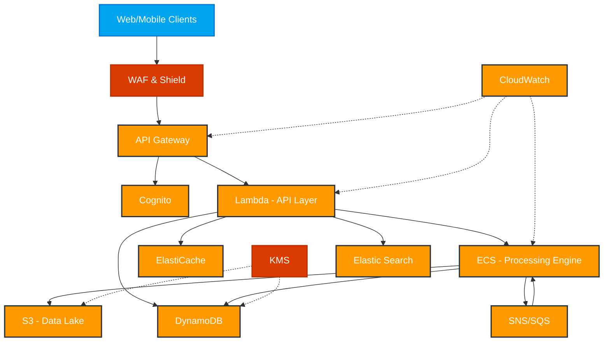
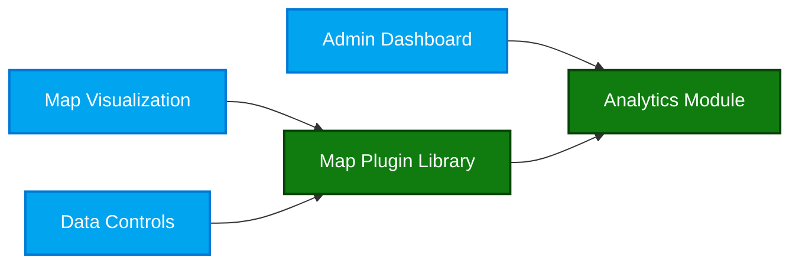
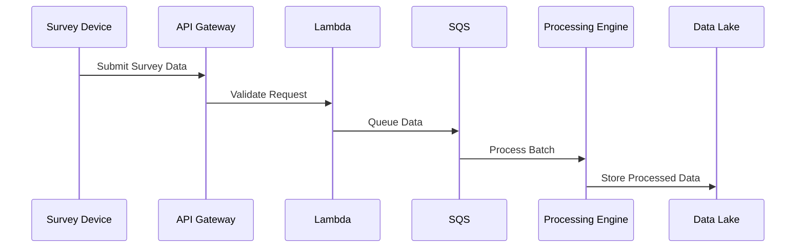
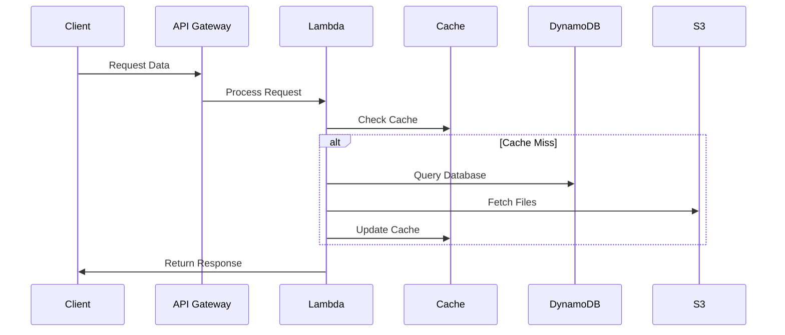
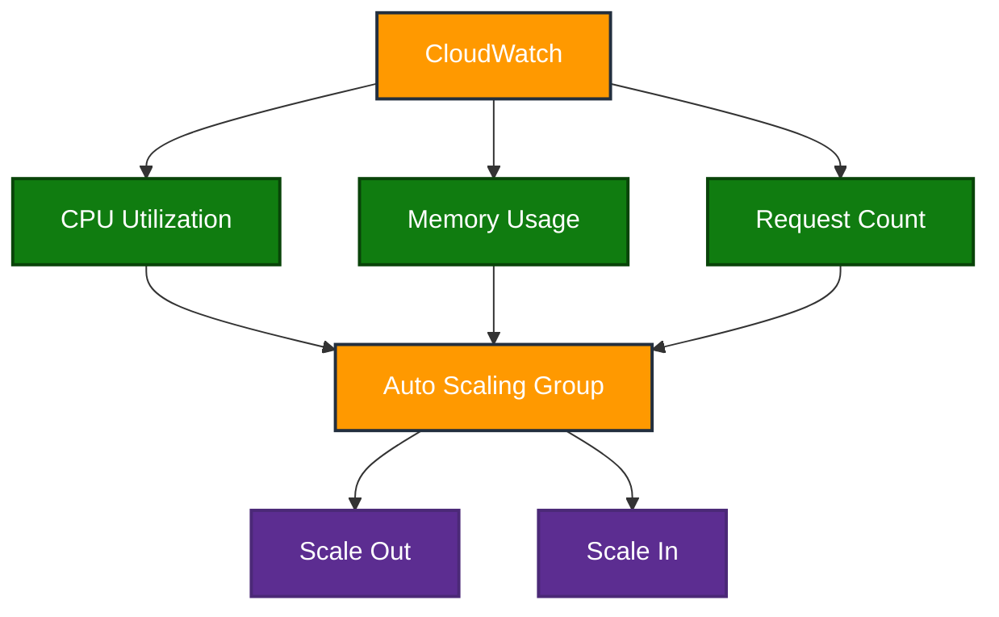
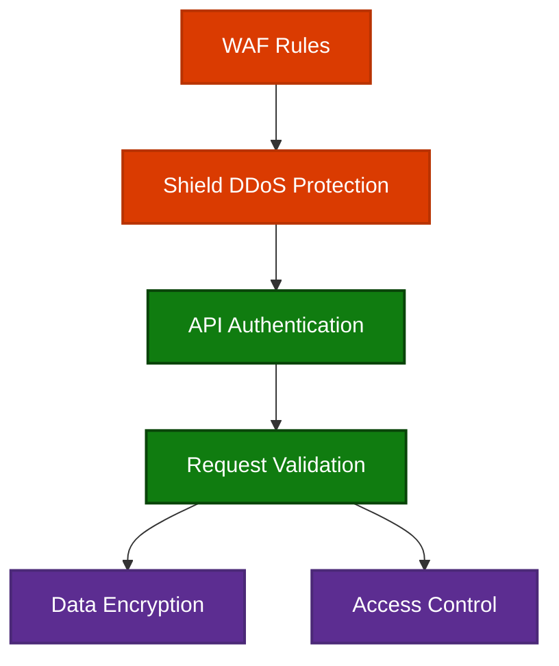
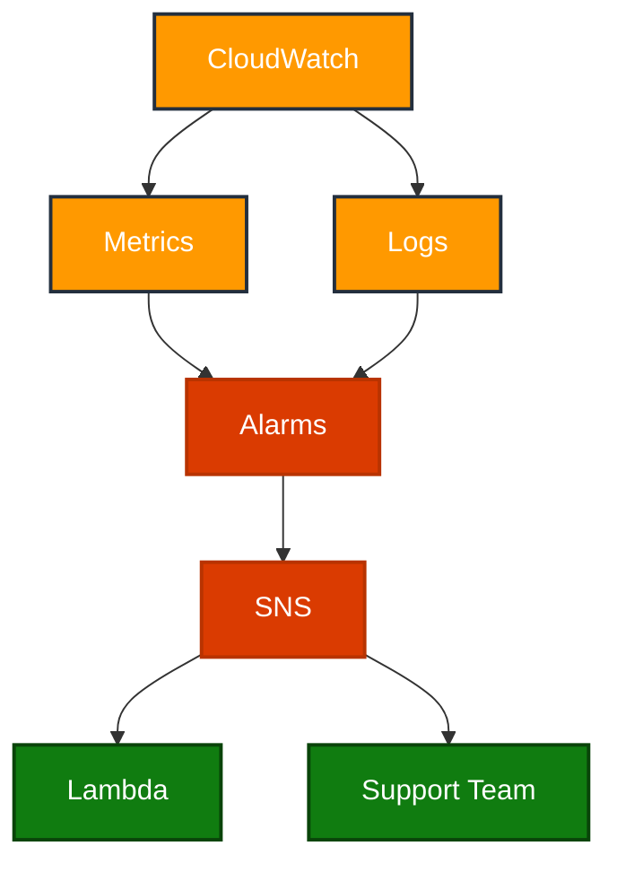

# GeoCell Intelligence Platform - High Level Design Document

## 1. System Architecture Overview

### 1.1 High-Level Architecture Diagram

## 2. Component Architecture

### 2.1 Frontend Layer

### 2.2 Data Processing Pipeline

## 3. AWS Services Integration

### 3.1 Core Services

| Service | Purpose | Configuration |
|---------|----------|--------------|
| **API Gateway** | API Management | - REST API - Custom domain - API key management |
| **Lambda** | Serverless Computing | - Node.js runtime - 512MB memory - 30s timeout |
| **ECS** | Container Orchestration | - Fargate launch type - Auto-scaling - Load balancing |
| **S3** | Data Storage | - Standard storage class - Lifecycle policies - Versioning enabled |
| **DynamoDB** | NoSQL Database | - On-demand capacity - Global tables - Point-in-time recovery |

### 3.2 Security Services

| Service | Purpose | Configuration |
|---------|----------|--------------|
| **Cognito** | Authentication | - User pools - Identity pools - MFA enabled |
| **WAF & Shield** | Protection | - DDoS protection - SQL injection prevention - Rate limiting |
| **KMS** | Encryption | - Customer managed keys - Automatic rotation - Audit logging |

## 4. Data Flow Architecture

### 4.1 Data Ingestion Flow

### 4.2 Data Retrieval Flow

## 5. Scalability Design

### 5.1 Auto-scaling Configuration

## 6. Security Architecture

### 6.1 Security Layers

## 7. Monitoring and Alerting

### 7.1 Monitoring Architecture

## 8. Disaster Recovery

### 8.1 Backup Strategy
- Daily automated backups
- Cross-region replication
- Point-in-time recovery
- Regular DR testing

### 8.2 Recovery Objectives
- RPO (Recovery Point Objective): < 15 minutes
- RTO (Recovery Time Objective): < 1 hour

## 9. Performance Optimization

### 9.1 Caching Strategy
- API response caching
- Database query caching
- Static asset caching
- Cache invalidation rules

### 9.2 Performance Targets
- API Response Time: < 500ms
- Data Processing: 10,000+ points/second
- Map Rendering: < 2 seconds
- Concurrent Users: 1000+

## 10. Integration Points

### 10.1 External Systems
- Google Maps API
- Payment Gateways
- Analytics Services
- Notification Services

### 10.2 Internal Systems
- Authentication Service
- Billing System
- Monitoring System
- Support System

## 11. Deployment Strategy

### 11.1 CI/CD Pipeline

## 12. System Constraints

### 12.1 Technical Limitations
- Maximum file size: 100MB
- API rate limit: 1000 requests/minute
- Data retention: 3 months
- Maximum polygon points: 10,000

### 12.2 Business Constraints
- Regulatory compliance requirements
- Budget limitations
- Timeline constraints
- Resource availability

## 13. Future Considerations

### 13.1 Planned Enhancements
- Machine learning integration
- Real-time analytics
- Advanced visualization features
- Additional data sources

### 13.2 Scalability Roadmap
- Multi-region deployment
- Enhanced caching strategy
- Microservices architecture
- Improved automation
