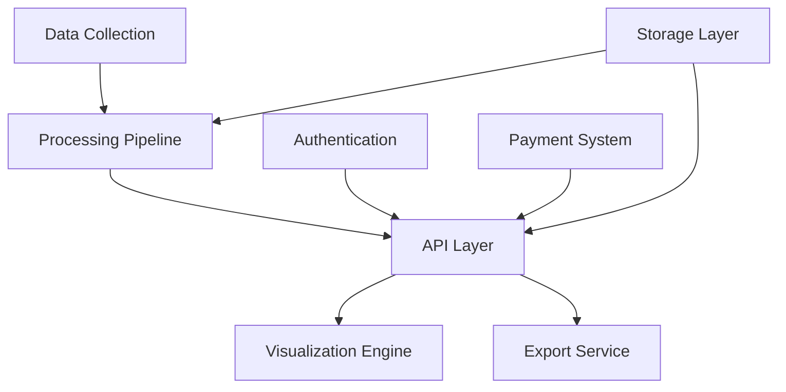

# GeoCell Intelligence Platform - Product Requirements Document (PRD)

## 1. Executive Summary
GeoCell Intelligence Platform is a Data-as-a-Service (DaaS) solution that transforms cellular survey data into actionable geospatial intelligence through an API-first platform with advanced visualization capabilities.

### 1.1 Business Objectives
- Democratize access to cellular geospatial data
- Provide real-time location intelligence
- Enable data-driven decision making across industries
- Generate recurring revenue through API subscriptions

### 1.2 Success Metrics
- API Response Time: < 500ms
- System Uptime: 99.9%
- Data Accuracy: > 99%
- Customer Satisfaction: > 90%
- User Growth: 20% QoQ

## 2. Product Overview

### 2.1 Core Features
1. **Data Processing Pipeline**
   - Automated survey data ingestion
   - Real-time data processing
   - Three-month rolling data window
   - Standardized output formats

2. **API Services**
   - RESTful API endpoints
   - Authentication & authorization
   - Rate limiting & quotas
   - Comprehensive documentation

3. **Visualization Engine**
   - Proprietary map plugin
   - Google Maps integration
   - Polygon generation algorithm
   - Custom styling options

4. **Payment Integration**
   - Tiered subscription model
   - Usage-based billing
   - Payment gateway integration
   - Invoice generation

### 2.2 Target Users
| Persona | Primary Needs | Key Features |
|---------|--------------|--------------|
| Law Enforcement | Security, quick access | Historical data, secure API |
| Retail Analyst | Location analysis | Heat maps, comparison tools |
| GIS Analyst | Data integration | KML export, plugin support |

## 3. Technical Requirements

### 3.1 API Specifications

#### 3.1.1 Authentication
```json
{
  "auth": {
    "type": "Bearer Token",
    "headers": {
      "Authorization": "Bearer <api_key>"
    }
  }
}
```

#### 3.1.2 Core Endpoints
```json
{
  "endpoints": {
    "GET /v1/coverage": {
      "description": "Retrieve coverage data for specified area",
      "parameters": {
        "lat": "number",
        "lng": "number",
        "radius": "number",
        "timeframe": "string"
      }
    },
    "GET /v1/polygons": {
      "description": "Generate coverage polygons",
      "parameters": {
        "cell_id": "string",
        "optimization_level": "number"
      }
    },
    "POST /v1/export": {
      "description": "Export data in specified format",
      "parameters": {
        "format": "string",
        "data_points": "array",
        "style_options": "object"
      }
    }
  }
}
```

### 3.2 Data Models

#### 3.2.1 Coverage Data
```json
{
  "CoveragePoint": {
    "cell_id": "string",
    "latitude": "number",
    "longitude": "number",
    "signal_strength": "number",
    "timestamp": "datetime",
    "accuracy": "number"
  }
}
```

#### 3.2.2 Polygon Data
```json
{
  "CoveragePolygon": {
    "id": "string",
    "cell_id": "string",
    "coordinates": "array",
    "metadata": {
      "confidence": "number",
      "last_updated": "datetime",
      "data_points": "number"
    }
  }
}
```

### 3.3 System Architecture



## 4. Feature Requirements

### 4.1 Data Processing Pipeline

#### Business Requirements
- Process raw survey data in real-time
- Maintain data accuracy above 99%
- Support multiple input formats
- Implement data validation rules

#### Technical Requirements
- Scalable processing architecture
- Error handling and retry mechanisms
- Data versioning system
- Monitoring and alerting

### 4.2 Visualization Engine

#### Business Requirements
- Intuitive map interface
- Multiple visualization options
- Custom branding support
- Export capabilities

#### Technical Requirements
- WebGL rendering support
- Optimized polygon generation
- Caching mechanism
- Cross-browser compatibility

### 4.3 Payment Integration

#### Business Requirements
- Flexible subscription tiers
- Usage-based billing
- Automated invoicing
- Payment history

#### Technical Requirements
- Secure payment processing
- Usage tracking system
- Quota management
- Billing API integration

## 5. Non-Functional Requirements

### 5.1 Performance
- API response time < 500ms
- Support 1000+ concurrent users
- Process 10,000+ data points/second
- 99.9% uptime guarantee

### 5.2 Security
- Data encryption at rest and in transit
- Role-based access control
- API key management
- Regular security audits

### 5.3 Scalability
- Horizontal scaling capability
- Auto-scaling based on load
- Multi-region support
- Load balancing

### 5.4 Compliance
- GDPR compliance
- Data retention policies
- Audit logging
- Privacy controls

## 6. Implementation Phases

### Phase 1: Foundation (Q1 2025)
- Core API development
- Basic data processing pipeline
- Initial visualization engine
- Basic authentication

### Phase 2: Enhancement (Q2 2025)
- Advanced polygon generation
- Google Maps integration
- Enhanced visualization
- Payment integration

### Phase 3: Scale (Q3 2025)
- Additional map plugins
- Analytics dashboard
- Real-time processing
- Enterprise features

### Phase 4: Innovation (Q4 2025)
- ML-based predictions
- Advanced security
- Custom reporting
- API marketplace

## 7. Dependencies

### 7.1 External Dependencies
- Google Maps API
- Payment gateway services
- Cloud infrastructure
- Data storage services

### 7.2 Internal Dependencies
- Hardware data collection systems
- Authentication services
- Billing systems
- Support infrastructure

## 8. Constraints

### 8.1 Technical Constraints
- API rate limits
- Data storage capacity
- Processing power limits
- Bandwidth restrictions

### 8.2 Business Constraints
- Budget limitations
- Timeline requirements
- Resource availability
- Regulatory requirements

## 9. Assumptions
1. Hardware data collection systems are operational
2. Third-party APIs remain stable
3. Data format standards don't change
4. Infrastructure scales as needed

## 10. Risks and Mitigations

| Risk | Impact | Probability | Mitigation |
|------|---------|------------|------------|
| Data accuracy degradation | High | Medium | Implement validation checks |
| API performance issues | High | Low | Load testing, monitoring |
| Security breach | High | Low | Regular audits, updates |
| Integration failures | Medium | Medium | Thorough testing, fallbacks |

## 11. Glossary

| Term | Definition |
|------|------------|
| KML | Keyhole Markup Language |
| DaaS | Data as a Service |
| API | Application Programming Interface |
| GIS | Geographic Information System |

## 12. Change Log

| Version | Date | Changes | Author |
|---------|------|---------|---------|
| 1.0 | 24/02/2025 | Initial PRD | Product Team |
