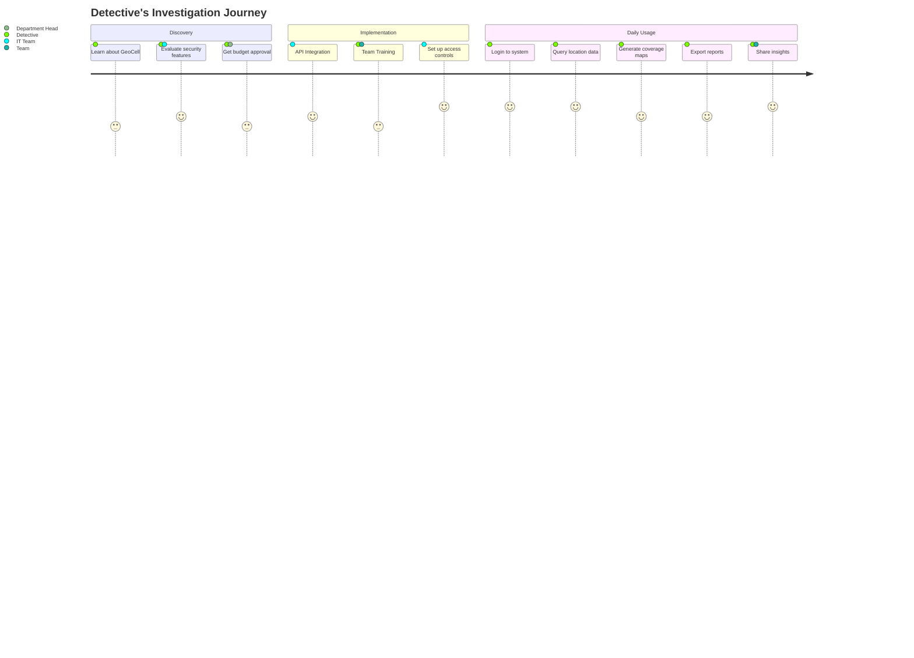
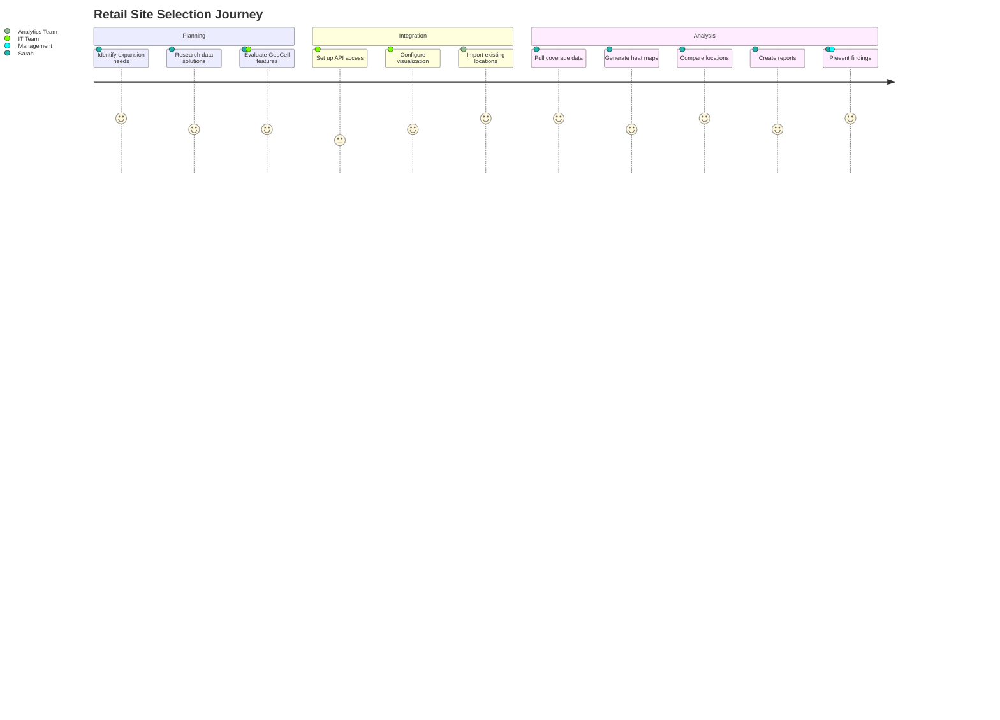
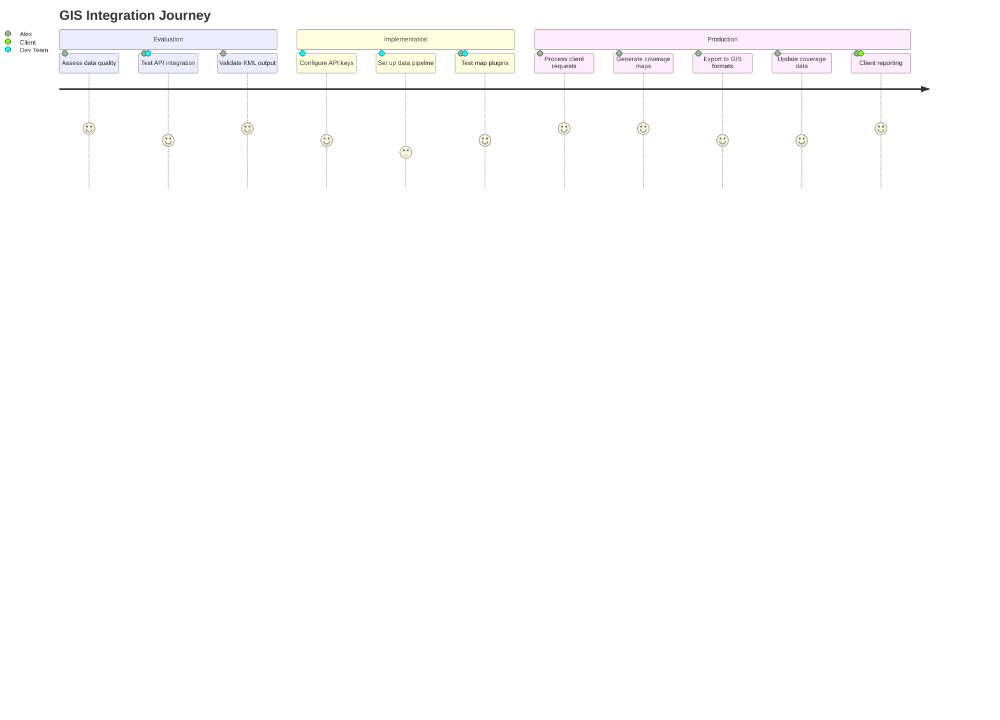

# User Journey Maps - GeoCell Intelligence Platform

## 1. Law Enforcement Investigator Journey

### Persona: Detective James Martinez
- Role: Criminal Investigation Detective
- Goals: 
  - Track cellular activity in areas of interest
  - Generate location-based intelligence for investigations
  - Access historical coverage data quickly

### Pain Points & Solutions
1. **Before GeoCell**
   - Manual data requests from carriers
   - Long wait times for information
   - Limited visualization capabilities

2. **After GeoCell**
   - Instant API access to coverage data
   - Real-time visualization
   - Standardized export formats
   - Secure data handling

## 2. Retail Analyst Journey

### Persona: Sarah Chen
- Role: Director of Real Estate Analytics
- Goals:
  - Analyze cellular activity for site selection
  - Track foot traffic patterns
  - Evaluate network coverage for potential locations

### Pain Points & Solutions
1. **Before GeoCell**
   - Weeks spent processing survey data
   - Inconsistent data formats
   - Limited analysis capabilities

2. **After GeoCell**
   - Automated data processing
   - Standardized formats
   - Quick comparison tools
   - Custom reporting

## 3. GIS Firm Analyst Journey

### Persona: Alex Kumar
- Role: Senior GIS Analyst
- Goals:
  - Integrate cellular coverage data into existing GIS solutions
  - Generate comprehensive coverage maps
  - Provide accurate coverage analysis to clients

### Pain Points & Solutions
1. **Before GeoCell**
   - Limited access to cellular data
   - Complex data transformation needs
   - Integration challenges

2. **After GeoCell**
   - Direct API access
   - GIS-compatible formats
   - Multiple visualization options
   - Regular data updates

## Key Touchpoints Across All Journeys

1. **Initial Contact**
   - Website discovery
   - Sales team interaction
   - Documentation access

2. **Onboarding**
   - API key provisioning
   - Technical documentation
   - Integration support

3. **Regular Usage**
   - API calls
   - Data visualization
   - Report generation

4. **Support**
   - Technical assistance
   - Feature requests
   - Issue resolution

## Success Metrics

1. **Adoption Metrics**
   - Time to first API call
   - Daily active users
   - Feature usage rates

2. **Performance Metrics**
   - API response time
   - Data accuracy
   - System uptime

3. **Satisfaction Metrics**
   - User satisfaction score
   - Support ticket resolution time
   - Feature request implementation rate

## Next Steps for Journey Optimization

1. Implement automated onboarding workflow
2. Develop user training materials
3. Create journey-specific documentation
4. Set up user feedback loops
5. Establish journey monitoring metrics
